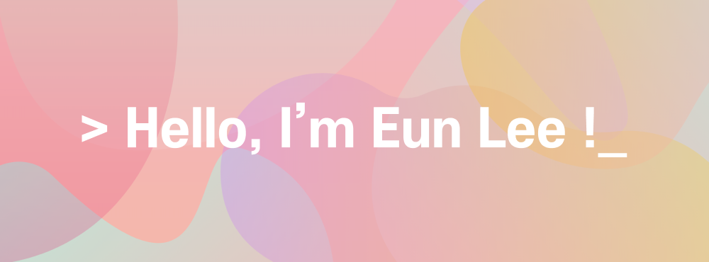

<!--
**oduodg/oduodg** is a ✨ _special_ ✨ repository because its `README.md` (this file) appears on your GitHub profile.

Here are some ideas to get you started:

- 🔭 I’m currently working on ...
- 🌱 I’m currently learning ...
- 👯 I’m looking to collaborate on ...
- 🤔 I’m looking for help with ...
- 💬 Ask me about ...
- 📫 How to reach me: ...
- 😄 Pronouns: ...
- ⚡ Fun fact: ...
-->

<!--  </img> -->

  
  
  
  
    
  
  
  
  
    
   
   
    
  
  

### About Me
- 🏫 I'm currently studying at Hongik University, in South Korea. (Expected to graduate 2023 Feb)
- 👩🏻‍💻 I'm double majoring in Industrial•Data Engineering and Computer Engineering.
- 🥰 I’m interested in CI/CD, Frontend development, Project management and SaaS.
- ☁️ I’m currently learning Cloud architecture(`Docker`, `K8s`, `AWS`) and `React`.

<!-- ### Projects -->

### Education
- 🎓 Hongik University(Seoul), Industrial Engineering&Computer Engineering (2016.03~2023.02)
- ☁️ 카카오 클라우드 스쿨 개발자 1기 (2022.06~2022.12)
- 🦁 홍익대학교 멋쟁이사자처럼 10기 운영진 (2022.01~2022.12)
- 🐘 빅데이터 연합동아리 BOAZ 18기 데이터 엔지니어링 부문 (2022.01~2022.06)

### Certificate & Prize

- 🍫 카카오 클라우드 스쿨 개발자 양성과정, 최우수 프로젝트상 (2022.12)
- 🍫 한국관광공사 x 카카오 2022 관광데이터 활용 공모전, 장려상 (2022.10)
- 🤖 KT AIFB Associated(2022.02)
- 🔤 홍익대학교 텍스트마이닝 & NLP 경진대회, 최우수상 (2022.01)
- 🌏 JLPT N1 (2019.01)

### Favorite

- ⌨️ Custom keyboard
- 🎹 Keyboard
- 😽 Cat
- 📺 Animation

